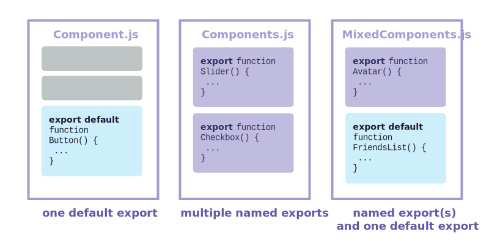

# Composants et JSX

---

## Créer un SPA

- Un **SPA** est une _Single Page App_
  - Par exemple: Google Maps, Netflix, Instagram, Twitter, etc.
  - Le serveur web doit être configuré pour rediriger toutes les requêtes HTTP vers la page _index_.
- Les SPA classiques sont 100% _front-end_, avec des interactions au _backend_ via des services REST API.
  - Les SPA modernes sont plus complexes et permettent une architecture hybride, où le _backend_ joue un rôle important.
    - On appelle cette approche le **Pespa** (Progressively Enhanced Single Page Apps)
    - https://www.epicweb.dev/the-webs-next-transition

---

## Points d'entrée

- Voici les conventions de **Vite**
- Une page `index.html` possède un `<div id="root"> </div>`
  - le `div` est vide
- le script de démarrage se nomme `main.tsx` (ou `index.js`)

- On pourrait générer des données dans la racine SANS utiliser React

```js
//On trouve le div
let rootNode = document.getElementById('root');

//Modifier le contenu du DOM. Sans React!
rootNode.innerHTML = '<h2>Bonjour tous!</h2>';
```

---

## JS classique, sans React

<Sandpack s="70" >

```html public/index.html
<!DOCTYPE html>
<html>
  <head>
    <title>My app</title>
  </head>
  <body>
    <div id="root"></div>
    <script type="module" src="/src/index.js"></script>
  </body>
</html>
```

```js src/index.js active
import('./style.css'); // Vite syntax.  No React!

const divRoot = document.getElementById('root');
divRoot.innerHTML = '<h1 style="color: blue">Hello World</h1>';

// Play with Interval, put 2000 100 or 100 and see the browser tools.

// function displayTime() {
//   divRoot.innerHTML = `<p>The current time is ${new Date().toLocaleTimeString()}</p>`;
// }

// setInterval(displayTime, 1000);
```

```css src/style.css
body {
  font-family: sans-serif;
  margin: 20px;
  padding: 0;
}
```

</Sandpack>

---

## Point d'entrée React

- Point d'entrée JS doit importer `react-dom/client`

- `createRoot` permet de créer une racine React pour le `<div>` racine.

```js
//On importe createRoot
import { createRoot } from 'react-dom/client';

//On trouve le divRoot
const divRoot = document.getElementById('root');

//On créé une racine React sur le divRoot
const root = ReactDOM.createRoot(divRoot);

//On affiche du jsx sur cette racine
root.render(<h1>Bonjour Tous!</h1>);
```

---

# Racine React

<Sandpack >

```html index.html
<!DOCTYPE html>
<html>
  <head>
    <title>My app</title>
  </head>
  <body>
    <div id="root"></div>
  </body>
</html>
```

```js src/index.js active
import { createRoot } from 'react-dom/client';
import('./styles.css');

const divRoot = document.getElementById('root');
const root = createRoot(divRoot);

root.render(<h1 style={{ color: 'blue' }}>Bonjour Tous!</h1>);

// strings are encoded
// root.render('<h1 style="color: blue">Hello World</h1>');

//----

// the "commit" phase will determine the minimal DOM update,
// by comparing the current and previous renders.
// See the inspect tools in browser

function DisplayTime() {
  root.render(<p>The current time is {new Date().toLocaleTimeString()}</p>);
}

// setInterval(DisplayTime, 1000);
```

</Sandpack>

---

## Jsx dans variable

On peut stocker le jsx dans une variable.

```jsx
let jsx = <h2>Bonjour Tous!</h2>;

root.render(jsx);
```

---

## Composant

Fonction qui retourne du JSX, combinant HTML, CSS et JS.

La première lettre doit être une majuscule.

```js
function Bonjour() {
  return <h2>Bonjour Tous!</h2>;
}

//on pourrait appeler tel qu'une fonction 🚫
root.render(Bonjour());

//Mieux vaut utiliser la syntaxe JSX  ✅
root.render(<Bonjour />);
```

---

## Distinguer entre Composant et DOM

**Règle** On distingue le Composant d'une balise DOM par la première lettre:

- `div` et `h1` commencent par des minuscules: React génère des balises HTML.
- `Bonjour` commence par une majuscule: React appelle le composant.

```js
root.render(
  <div>
    <h1>Salutations</h1>
    <Bonjour />
    <Bonjour />
    <Bonjour />
  </div>
);
```

---

## Découper les composants dans fichiers différents

**Règle** Quand on isole le composant dans son propre fichier, il faut utiliser `export default`

**Règle** Quand on écrit le JSX sur plusieurs lignes, il faut entourer de parenthèses ()

<TwoColumns style={{alignItems: 'stretch'}}>

```js
export default function Bonjour() {
  return <h2>Bonjour Tous!</h2>;
}
```

```js
export default function Bonjour() {
  return <h2>Bonjour Tous!</h2>;
}
```

</TwoColumns>

---

## Le JSX ne permet qu'une seule racine

<TwoColumns style={{alignItems: 'stretch'}}>

```js
// Erreur: deux racines  🚫
<h1>Titre</h1>
<h2>Sous-titre</h2>
```

```js
// une racine qui englobe  ✅
<div>
  <h1>Titre</h1>
  <h2>Sous-titre</h2>
</div>
```

</TwoColumns>

---

## Le fragment

Le fragment permet d'englober sans générer d'élément dans le DOM

<TwoColumns style={{alignItems: 'stretch'}}>

```js
// Fragment avec importation ✅
import { Fragment } from 'react';

<Fragment>
  <h1>Titre</h1>
  <h2>Sous-titre</h2>
</Fragment>;
```

```js
// Fragment implicite  ✅✅
<>
  <h1>Titre</h1>
  <h2>Sous-titre</h2>
</>
```

</TwoColumns>

Les 2 approches sont équivalentes (compilent de façon identique). La seconde est plus populaire.

---

## Pas de composants imbriqués

Ne jamais imbriquer les composants les uns dans les autres.

<aside style={{display:'grid', gridTemplateColumns:"1fr 1fr", columnGap:5}}>

```js
function Composant1() {
  function Composant2() {
    //Composant imbriqué  🚫
    return <br />;
  }
  return <Composant2 />;
}
```

```js
function Composant1() {
  //Pas imbriqué  ✅
  return <Composant2 />;
}

function Composant2() {
  //Pas imbriqué  ✅
  return <br />;
}
```

</aside>

C'est correct d'imbriquer des gestionnaires d'événements et d'autres fonctions.

Le problème d'imbriquer des composants, c'est la performance. (Chaque rendu de Composant1 va générer un nouveau Composant2, avec un nouvel état... )

---

### Défi 1

Il manque quelque chose pour que le fichier soit détectable par React. (indice: exportation)

<Sandpack>

```js
function Profile() {
  return ;
}
```

```css
img {
  height: 181px;
}
```

</Sandpack>

---

### Défi 2

La commande `return` ne fonctionne pas. Commment réparer?

<Sandpack>

```js
export default function Profile() {
  return;
  ;
}
```

```css
img {
  height: 180px;
}
```

</Sandpack>

---

### Défi 3

Pourquoi cela échoue? (Indice: qu'est-ce qui distingue les composants et les balises html.)

<Sandpack>

```js
function profile() {
  return ;
}

export default function Gallery() {
  return (
    <section>
      <h1>Liste de personnes</h1>
      <profile />
      <profile />
      <profile />
    </section>
  );
}
```

```css
img {
  margin: 0 10px 10px 0;
  height: 90px;
}
```

</Sandpack>

---

### Défi 4

        Écrire un composant `Entete` qui retourne un gros titre qui
          dit `Bravo!`.

<Sandpack>

```js
// Écrivez votre composant ici...
```

</Sandpack>

---

## Racine App

**Convention:** avec Create-React-App et Vite, la composante racine se nomme `App.jsx`.

**Convention:** On peut utiliser l'extension `.jsx` ou `.js`

{/* prettier-ignore */}
- Les extensions sont interchangeables
  - `Vite`, `Github` et `Remix` préfèrent `.jsx`
  - `Next` et `React` préfèrent `.js`

<div></div>

- Pour l'importation, l'extension `.js` ou `.jsx` est optionnelle.

```js
import Composant from './Composant.js';  ✅
import Composant from './Composant';  ✅ ✅
```

---

## Séparer des composants (VS Code)

Réusiner ou remanier le code (refactoring) par outils de VSCode.

##### Séparer jsx vers un composant

1. `Ctrl-.` sur du JSX sélectionné (ou clic-droit, menu `Remanier...`(`Refactor...`))
2. Sélectionner `Extraire vers function dans la portée module` (`Extract function to module scope`)

##### Isoler composant vers un nouveau fichier

1. `Ctrl-.` sur nom de fonction (ou clic-droit, menu `Remanier...` (`Refactor...`))
2. Sélectionner `Déplacer vers un nouveau fichier` (`Move to a new file`)
3. `Ctrl-.` sur mot export (ou clic-droit, menu `Remanier...` (`Refactor...`))
4. Sélectionner `Convert named export to default export`

---

## Séparer des composants (Manuellement)

Il faut ajouter un `export` (nommé) ou un `export default` quand on déplace le code.

Ne pas oublier d'adapter l'importation avec la commande import

- avec accolades {} pour une exportation nommée
- sans accolades pour l'exportation par défaut

---

## Types d'Exportations



import '../table-rows.css';

<div className="my-tbl" >

| Syntaxe    | Export                                | Import                                |
| ---------- | ------------------------------------- | ------------------------------------- |
| Par défaut | `export default function Button() {}` | `import  Button  from './button.js';` |
| Nommée     | `export         function Button() {}` | `import {Button} from './button.js';` |

</div>

<br />

- Avec un import par défaut, on peut renommer l'importation comme on veut.
- ex: `import LeBouton from './button.js';`

---

### Défi 5

Déplacer la composante Profile dans son fichier `Profile.js`;

<Sandpack>

```js src/App.js
import Gallery from './Gallery.js';
import { Profile } from './Gallery.js';

export default function App() {
  return (
    <div>
      <Profile />
    </div>
  );
}
```

```js src/Gallery.js active
// déplacer ceci vers Profile.js!
export function Profile() {
  return ;
}

export default function Gallery() {
  return (
    <section>
      <h1>Liste de personnalités</h1>
      <Profile />
      <Profile />
      <Profile />
    </section>
  );
}
```

```js src/Profile.js
// vide pour le moment
```

```css
img {
  margin: 0 10px 10px 0;
  height: 90px;
}
```

</Sandpack>

---

## Formule JSX

- Grâce au JSX, on combine HTML et JavaScript ensemble.
- JSX et React sont deux technologies différentes et séparées
  - On pourrait utiliser l'un sans l'autre

---

## Règles de JSX

1. **Une seule racine**

On peut combiner avec une balise qui englobe (`<div>`) ou un fragment (`<></>`)

<hr />

2. **Balises sont explicitement fermées**

Pas de `` mais plutôt ``

<hr />

3. **Utiliser le camelCase pour les attributs**

JSX est converti en JavaScript par la boîte à outils. Les attributs sont alors transformés en propriétés du DOM (qui sont en camelCase).

`stroke-width` devient `strokeWidth`, `class` devient `className` (car `class` est un mot-réservé en JS).

Consultez la liste des attributs sur la [documentation React](https://react.dev/reference/react-dom/components/common)

**Exception:** `aria-*` et `data-*`

---

### Défi 6

Réparer les nombreuses petites erreurs du code JSX

<Sandpack>

```js
export default function Bio() {
  return (
    <div class="intro">
      <h1>Bienvenue à mon site Web!</h1>
    </div>
    <p class="summary">
      Vous pouvez lire mes réflexions
      <br><br>
      <b>et voir des <i>photos</b></i> de gens!
    </p>
  );
}
```

```css
.intro {
  background-image: linear-gradient(
    to left,
    violet,
    indigo,
    blue,
    green,
    yellow,
    orange,
    red
  );
  background-clip: text;
  color: transparent;
  -webkit-background-clip: text;
  -webkit-text-fill-color: transparent;
}

.summary {
  padding: 20px;
  border: 10px solid gold;
}
```

</Sandpack>

---

## JavaScript dans JSX

On utilise les accolades {} pour insérer des expressions Javascript dans JSX

```jsx
//js dans le texte jsx
<h1>Bonjour {user.name}!</h1>
```

```jsx
//js utilisé avec attributs

```

```jsx
//Deux paires d'accolades:
//la première pour utiliser du JS,
//la seconde pour définir un objet JS

```

---

### Défi 7

Réparer pourquoi ceci échoue avec l'erreur `Objects are not valid as a
React child`.

<Sandpack>

```js
const person = {
  name: 'Gregorio Y. Zara',
  theme: {
    backgroundColor: 'black',
    color: 'pink',
  },
};

export default function TodoList() {
  return (
    <div style={person.theme}>
      <h1>Les choses à faire pour {person}</h1>
      
      <ul>
        <li>Acheter du lait</li>
        <li>Promener le chien</li>
        <li>Faire la lessive</li>
      </ul>
    </div>
  );
}
```

```css
body {
  padding: 0;
  margin: 0;
}
body > div > div {
  padding: 20px;
}
.avatar {
  border-radius: 50%;
  height: 90px;
}
```

</Sandpack>

---

### Défi 8

Enlever l'URL de l'image pour l'ajouter dans l'objet `person`

<Sandpack>

```js
const person = {
  name: 'Gregorio Y. Zara',
  theme: {
    backgroundColor: 'black',
    color: 'pink',
  },
};

export default function TodoList() {
  return (
    <div style={person.theme}>
      <h1>Les choses à faire pour {person.name}</h1>
      
      <ul>
        <li>Acheter du lait</li>
        <li>Promener le chien</li>
        <li>Faire la lessive</li>
      </ul>
    </div>
  );
}
```

```css
body {
  padding: 0;
  margin: 0;
}
body > div > div {
  padding: 20px;
}
.avatar {
  border-radius: 50%;
  height: 90px;
}
```

</Sandpack>

---

### Défi 9

Dans l'objet ci-bas, l'url de l'image est séparé en 4 parties.

- base URL (toujours `'https://i.imgur.com/'`)
- `imageId` (`'7vQD0fP'`),
- `imageSize` (`'s'`),
- l'extention de fichier (toujours `'.jpg'`).

Réparez le code. (Indice: utilisez un gabarit (string template))

<Sandpack>

```js
const baseUrl = 'https://i.imgur.com/';
const person = {
  name: 'Gregorio Y. Zara',
  imageId: '7vQD0fP',
  imageSize: 's',
  theme: {
    backgroundColor: 'black',
    color: 'pink',
  },
};

export default function TodoList() {
  return (
    <div style={person.theme}>
      <h1>Les choses à faire pour {person.name}</h1>
      
      <ul>
        <li>Acheter du lait</li>
        <li>Promener le chien</li>
        <li>Faire la lessive</li>
      </ul>
    </div>
  );
}
```

```css
body {
  padding: 0;
  margin: 0;
}
body > div > div {
  padding: 20px;
}
.avatar {
  border-radius: 50%;
  height: 90px;
}
```

</Sandpack>

---

## Passer des props dans des composants

React utilise des props pour passer de l'information entre les composants.

On peut passer des chaînes de caractères, des objets, des tableaux, des fonctions, etc.

---

## Props familiers

`className, src, alt, width, height` sont des props familiers

<Sandpack>

```js
function Avatar() {
  return (
    
  );
}

export default function Profile() {
  return <Avatar />;
}
```

```css
body {
  min-height: 120px;
}
.avatar {
  margin: 20px;
  border-radius: 50%;
}
```

</Sandpack>

---

## Pousser des props au composant enfant

```jsx
<Avatar
  person={{ name: 'Lin Lanying', imageId: '1bX5QH6' }}
  size={100}
  rounded
/>
```

`rounded` n'est pas spécifié, c'est initialisé à `true` par défaut

---

## Lire les props

<TwoColumns  top>

```js
// lecture du paramètre props   ✅
function Avatar(props) {
  let person = props.person;
  let size = props.size;
  // ...
}
```

```js
// décomposition du paramètre props   ✅✅✅
function Avatar({ person, size }) {
  // person et size sont accessibles
}
```

</TwoColumns>

Les deux approches sont équivalentes.

L'affectation par décomposition (destructuring) avec `{}` est populaire.

---

## Valeur Par défaut

```js
function Avatar({ person, size = 100 }) {
  // ...
}
```

La valeur par défaut est utilisée quand `size` n'est pas présent ou quand `size={undefined}`

---

## Passer des props avec la syntaxe de décomposition (spread)

<TwoColumns top>

```jsx
// Approche détaillée
function Profile({
  person,
  size, //
  isSepia,
  thickBorder,
}) {
  return (
    <div className='card'>
      <Avatar
        person={person}
        size={size}
        isSepia={isSepia}
        thickBorder={thickBorder}
      />
    </div>
  );
}
```

```jsx
// Approche syntaxe de décomposition
// en anglais: spread syntax
function Profile(props) {
  return (
    <div className='card'>
      <Avatar {...props} />
    </div>
  );
}
```

</TwoColumns>

Les deux approches sont équivalentes.

---

## Passer du JSX ou contenu en props children

```js
<Cadre>
  <Avatar />
</Cadre>;

function Cadre({ children }) {
  return <div className='cadre'>{children}</div>;
}
```

---

## Exemple avec children

<Sandpack>

```js src/App.js
import Avatar from './Avatar.js';

function Card({ children }) {
  return <div className='card'>{children}</div>;
}

export default function Profile() {
  return (
    <Card>
      <Avatar
        size={100}
        person={{
          name: 'Katsuko Saruhashi',
          imageId: 'YfeOqp2',
        }}
      />
    </Card>
  );
}
```

```js src/Avatar.js
import { getImageUrl } from './utils.js';

export default function Avatar({ person, size }) {
  return (
    
  );
}
```

```js src/utils.js
export function getImageUrl(person, size = 's') {
  return 'https://i.imgur.com/' + person.imageId + size + '.jpg';
}
```

```css
.card {
  width: fit-content;
  margin: 5px;
  padding: 5px;
  font-size: 20px;
  text-align: center;
  border: 1px solid #aaa;
  border-radius: 20px;
  background: #fff;
}
.avatar {
  margin: 20px;
  border-radius: 50%;
}
```

</Sandpack>

---

## Caractéristiques des props

- Les props reçus sont en lecture seulement. Il faut les considérer _immuables_.

- On ne peut changer un props. Si on a besoin d'interactivité, on utilise plutôt l'état (state).

---

### Défi 10

Le composant `Gallery` contient des balises similaires pour afficher les profiles. Extraire un composant `Profile` pour réduire le code redondant. Choisissez les props nécessaires.

<Sandpack>

```js src/App.js
import { getImageUrl } from './utils.js';

export default function Gallery() {
  return (
    <div>
      <h1>Scientifiques remarquables</h1>
      <section className='profile'>
        <h2>Maria Skłodowska-Curie</h2>
        
        <ul>
          <li>
            <b>Spécialité: </b>
            Physique et Chimie
          </li>
          <li>
            <b>Prix et distinctions: 4 </b>
            (Prix Nobel en physique, Prix Nobel en Chimie, Médaille Davy, Médaille
            Matteucci)
          </li>
          <li>
            <b>Découverte: </b>
            polonium (élément)
          </li>
        </ul>
      </section>
      <section className='profile'>
        <h2>Katsuko Saruhashi</h2>
        
        <ul>
          <li>
            <b>Spécialité: </b>
            Géo-chimie
          </li>
          <li>
            <b>Prix et distinctions: 2 </b>
            (Prix géochimie Miyake, Prix Tanaka)
          </li>
          <li>
            <b>Découverte: </b>
            méthode pour mesurer le dioxide de carbone dans l'eau de mer
          </li>
        </ul>
      </section>
    </div>
  );
}
```

```js src/utils.js
export function getImageUrl(imageId, size = 's') {
  return 'https://i.imgur.com/' + imageId + size + '.jpg';
}
```

```css
.avatar {
  margin: 5px;
  border-radius: 50%;
  min-height: 70px;
}
.profile {
  border: 1px solid #aaa;
  border-radius: 6px;
  margin-top: 20px;
  padding: 10px;
}
h1,
h2 {
  margin: 5px;
}
h1 {
  margin-bottom: 10px;
}
ul {
  padding: 0px 10px 0px 20px;
}
li {
  margin: 5px;
}
```

</Sandpack>

---

### Défi 11

Dans cet exemple, la taille affiché est 40. Mais la taille de l'image téléchargée est 160px.

Changez le composant `Avatar` pour télécharger l'image d'après la taille d'affichage. Si la taille est moins de 90, passez le paramètre `s` (small) plutôt que `b` (big) à la fonction `getImageUrl`. Testez en affichant des Avatars de tailles différentes. (Bonus: on pourrait prendre en compte les écrans denses avec `window.devicePixelRatio`)

<Sandpack>

```js src/App.js
import { getImageUrl } from './utils.js';

function Avatar({ person, size }) {
  return (
    
  );
}

export default function Profile() {
  return (
    <Avatar
      size={40}
      person={{
        name: 'Gregorio Y. Zara',
        imageId: '7vQD0fP',
      }}
    />
  );
}
```

```js src/utils.js
export function getImageUrl(person, size) {
  return 'https://i.imgur.com/' + person.imageId + size + '.jpg';
}
```

```css
.avatar {
  margin: 20px;
  border-radius: 50%;
}
```

</Sandpack>

---

### Défi 12

Extraire un composant `Card` du code ci-bas. Utilisez la prop `children` pour lui passer du JSX différent:

<Sandpack>

```js
export default function Profile() {
  return (
    <div>
      <div className='card'>
        <div className='card-content'>
          <h1>Photo</h1>
          
        </div>
      </div>
      <div className='card'>
        <div className='card-content'>
          <h1>À Propos</h1>
          <p>
            Aklilu Lemma est un scientifique Éthiopien qui a découvert un
            traitement naturel au schistosomiase.
          </p>
        </div>
      </div>
    </div>
  );
}
```

```css
.card {
  width: fit-content;
  margin: 20px;
  padding: 20px;
  border: 1px solid #aaa;
  border-radius: 20px;
  background: #fff;
}
.card-content {
  text-align: center;
}
.avatar {
  margin: 10px;
  border-radius: 50%;
}
h1 {
  margin: 5px;
  padding: 0;
  font-size: 24px;
}
```

</Sandpack>

---

## Rendu conditionnel

Différentes approches

<TwoColumns top>
<div>

Méthode classique, utiliser des instructions `if`:

```jsx
let contenu;
if (vip) {
  contenu = <Vip />;
} else {
  contenu = <Regulier />;
}
return <div>{contenu}</div>;
```

</div>

<div>

Méthode compacte, utiliser l'opérateur conditionnel ternaire <br/> `(expression ? resultat_vrai : resultat_faux)`

```jsx
<div>{vip ? <Vip /> : <Regulier />}</div>
```

Méthode sans `else`, utiliser l'opérateur logique `&&`

```jsx
<div>{vip && <Vip />}</div>
```

</div>

</TwoColumns>

---

## Affichage conditionnel avec bloc if

<Sandpack>

```js
function Item({ name, isPacked }) {
  if (isPacked) {
    return <li className='item'>{name} ✅</li>;
  }
  return <li className='item'>{name}</li>;
}

export default function PackingList() {
  return (
    <section>
      <h1>Sally Ride's Packing List</h1>
      <ul>
        <Item isPacked={true} name='Space suit' />
        <Item isPacked={true} name='Helmet with a golden leaf' />
        <Item isPacked={false} name='Photo of Tam' />
      </ul>
    </section>
  );
}
```

</Sandpack>

---

## Affichage conditionnel avec null

<Sandpack>

```js
function Item({ name, isPacked }) {
  if (isPacked) {
    return null;
  }
  return <li className='item'>{name}</li>;
}

export default function PackingList() {
  return (
    <section>
      <h1>Sally Ride's Packing List</h1>
      <ul>
        <Item isPacked={true} name='Space suit' />
        <Item isPacked={true} name='Helmet with a golden leaf' />
        <Item isPacked={false} name='Photo of Tam' />
      </ul>
    </section>
  );
}
```

</Sandpack>

---

## Condition avec opérateur ternaire

<Sandpack>

```js
function Item({ name, isPacked }) {
  return (
    <li className='item'>{isPacked ? <del>{name + ' ✅'}</del> : name}</li>
  );
}

export default function PackingList() {
  return (
    <section>
      <h1>Sally Ride's Packing List</h1>
      <ul>
        <Item isPacked={true} name='Space suit' />
        <Item isPacked={true} name='Helmet with a golden leaf' />
        <Item isPacked={false} name='Photo of Tam' />
      </ul>
    </section>
  );
}
```

</Sandpack>

---

## Condition avec Opérateur logique &&

<Sandpack>

```js
function Item({ name, isPacked }) {
  return (
    <li className='item'>
      {name} {isPacked && '✅'}
    </li>
  );
}

export default function PackingList() {
  return (
    <section>
      <h1>Sally Ride's Packing List</h1>
      <ul>
        <Item isPacked={true} name='Space suit' />
        <Item isPacked={true} name='Helmet with a golden leaf' />
        <Item isPacked={false} name='Photo of Tam' />
      </ul>
    </section>
  );
}
```

</Sandpack>

---

## Attention

- Ne pas mettre un nombre dans l'opérande de gauche avec `&&`
- Cela pourrait afficher 0, alors qu'on s'attend à ne rien afficher.
- I faut convertir le nombre en booléen, avec une expression JS.

<hr />

<TwoColumns>

<div>
À éviter: 🚫

```js
messageCount && <p>New messages</p>;
```

</div>
<div>
Préférable: ✅

```js
messageCount > 0 && <p>New messages</p>;
```

</div>
</TwoColumns>

---

### Défi 13

Utilisez l'opérateur ternaire conditionnel (`cond ? a : b`) pour afficher ❌ quand `estRangé` n'est pas vrai.

<Sandpack>

```js
function Item({ nom, estRangé }) {
  return (
    <li className='item'>
      {nom} {estRangé && '✔'}
    </li>
  );
}

export default function ListeBaggages() {
  return (
    <section>
      <h1>Liste du contenu des baggages</h1>
      <ul>
        <Item estRangé={true} nom='Brosse à dents' />
        <Item estRangé={true} nom='Maillot de bain' />
        <Item estRangé={false} nom='Guitare' />
      </ul>
    </section>
  );
}
```

</Sandpack>

---

### Défi 14

Dans cet exemple, chaque `Item` reçoit une prop numérique nommée `importance`. Utilisez l'opérateur && pour afficher _(Importance: X)_ en italiques, mais seulement pour les items qui ont une importance autre que 0.

Votre liste d'items doit ressembler à ceci:

- Brosse à dents _(Importance: 9)_
- Maillot de bain
- Guitare _(Importance: 6)_

Noubliez pas l'espace entre les deux étiquettes. `{' '}`

<Sandpack>

```js
function Item({ nom, importance }) {
  return <li className='item'>{nom}</li>;
}

export default function PackingList() {
  return (
    <section>
      <h1>Liste pour le voyage</h1>
      <ul>
        <Item importance={9} nom='Brosse à dents' />
        <Item importance={0} nom='Maillot de bain' />
        <Item importance={6} nom='Guitare' />
      </ul>
    </section>
  );
}
```

</Sandpack>

---

### Défi 15

La composante `Boisson` utilise une série de conditions ternaires ` ? :` pour afficher différentes informations dépendant si le nom de la boisson est un "thé" ou un "café". Le problème c'est que l'information est répartie à travers diverses conditions. Réécrivez ce code pour n'utiliser qu'un seul `if` plutôt que trois opérations ternaires.

<Sandpack>

```js
function Boisson({ nom }) {
  return (
    <section>
      <h1>{nom}</h1>
      <dl>
        <dt>Partie de la plante</dt>
        <dd>{name === 'thé' ? 'feuilles' : 'grains'}</dd>
        <dt>Taux de Caféine</dt>
        <dd>{name === 'thé' ? '15–70 mg/tasse' : '80–185 mg/tasse'}</dd>
        <dt>Age</dt>
        <dd>{name === 'thé' ? '4 000+ ans' : '1 000+ ans'}</dd>
      </dl>
    </section>
  );
}

export default function ListeBoissons() {
  return (
    <div>
      <Boisson nom='thé' />
      <Boisson nom='café' />
    </div>
  );
}
```

</Sandpack>

---

## Gérer des listes

Il est facile d'utiliser des fonctions telles que `map` et `filter` pour travailler avec des données.

```js
const people = [
  'François Legault: politicien',
  'Isabelle Boulay: artiste',
  'François Bellefeuille: humoriste',
  'Pierre Lapointe: artiste',
  'Véronique Cloutier: animatrice',
];
```

Convertir un tableau de string en tableau de JSX:

```js
const listItems = people.map((person) => <li>{person}</li>);
```

Afficher le JSX:

```js
return <ul>{listItems}</ul>;
```

---

## Exemple simple

<Sandpack>

```js
const people = [
  'François Legault: politicien',
  'Isabelle Boulay: artiste',
  'François Bellefeuille: humoriste',
  'Pierre Lapointe: artiste',
  'Véronique Cloutier: animatrice',
];

export default function DisplayList() {
  const listItems = people.map((person) => <li>{person}</li>);

  return <ul>{listItems}</ul>;
}
```

</Sandpack>

Le warning dans la console sera expliqué dans quelques exemples.

---

## Données complexes

`.filter` est une fonction standard de js.

<Sandpack>

```jsx src/App.jsx
import { people } from './data.js';
import { getImageUrl } from './utils.js';

export default function List() {
  const chemists = people.filter((person) => person.profession === 'chemist');
  const listItems = chemists.map((person) => (
    <li>
      
      <p>
        <b>{person.name}:</b>
        {' ' + person.profession + ' '}
        known for {person.accomplishment}
      </p>
    </li>
  ));
  return <ul>{listItems}</ul>;
}
```

```js src/data.js
export const people = [
  {
    id: 0,
    name: 'Creola Katherine Johnson',
    profession: 'mathematician',
    accomplishment: 'spaceflight calculations',
    imageId: 'MK3eW3A',
  },
  {
    id: 1,
    name: 'Mario José Molina-Pasquel Henríquez',
    profession: 'chemist',
    accomplishment: 'discovery of Arctic ozone hole',
    imageId: 'mynHUSa',
  },
  {
    id: 2,
    name: 'Mohammad Abdus Salam',
    profession: 'physicist',
    accomplishment: 'electromagnetism theory',
    imageId: 'bE7W1ji',
  },
  {
    id: 3,
    name: 'Percy Lavon Julian',
    profession: 'chemist',
    accomplishment:
      'pioneering cortisone drugs, steroids and birth control pills',
    imageId: 'IOjWm71',
  },
  {
    id: 4,
    name: 'Subrahmanyan Chandrasekhar',
    profession: 'astrophysicist',
    accomplishment: 'white dwarf star mass calculations',
    imageId: 'lrWQx8l',
  },
];
```

```js src/utils.js
export function getImageUrl(person) {
  return 'https://i.imgur.com/' + person.imageId + 's.jpg';
}
```

```css
ul {
  list-style-type: none;
  padding: 0px 10px;
}
li {
  margin-bottom: 10px;
  display: grid;
  grid-template-columns: auto 1fr;
  gap: 20px;
  align-items: center;
}
img {
  width: 100px;
  height: 100px;
  border-radius: 50%;
}
```

</Sandpack>

---

### Faire un map

Map retourne un nouveau tableau d'éléments.

```js
const listItems = chemists.map((person) => (
  <li>
    
    <p>
      <b>{person.name}:</b>
      {' ' + person.profession}
    </p>
  </li>
));
```

Afficher les résultats

```js
return <ul>{listItems}</ul>;
```

---

## Note sur les fonctions flèches

Si on écrit une fonction fèche **avec** accolades {}, il faut mettre le `return` explicitement.

```js
const liste = artistes.map((p) => {
  return <li>...</li>;
});
```

Si on écrit une fonction flèche **sans** accolades, le `return` est implicite et il ne faut pas l'écrire.

```js
const liste = artistes.map((p) => <li>...</li>);
```

---

## Gérer les clés

Si on oublie de spécifier une `key` unique, un message est affiché dans la console

<div className='alert alert-danger'>
  Warning: Each child in a list should have a unique “key” prop.
</div>

Pour éliminer le message, il faut utiliser une clé unique.
Il faut fournir cela pour n'importe quel tableau de JSX, incluant le `map`.

Ceci améliore les performances si on doit _trier_, _ajouter_ ou _enlever_
des éléments. Ceci permet à React de mieux comprendre ce qui a été modifié.

---

## Performance sans clés (modification optimale)

Imaginons un ajout dans une liste JSX, à la toute fin:

<TwoColumns top> 
<div>
#### Avant
```js
<ul>
  <li>Bob</li>
  <li>Amy<li>
  <li>Joe</li>
  <li>Mary</li>
</ul>
```
</div>
<div>
#### Après
```js {6}
<ul>
  <li>Bob</li>
  <li>Amy<li>
  <li>Joe</li>
  <li>Mary</li>
  <li>Bill</li>
</ul>
```
</div>
</TwoColumns>

Dans la phase commit, on compare par position. Toutes les positions sont identiques sauf la dernière. Il suffit simplement d'ajouter le `<li>` avec Bill. La réconciliation est optimale, car on ne touche pas beaucoup au DOM.

---

## Perfomance sans clés (modification difficile)

Maintenant, imaginons un ajout dans une liste JSX, mais **au tout début**:

<TwoColumns top> 
<div>
#### Avant
```js
<ul>
  <li>Bob</li>
  <li>Amy<li>
  <li>Joe</li>
  <li>Mary</li>
  <li>Bill</li>
</ul>
```
</div>
<div>
#### Après
```js {2-7}
<ul>
  <li>Luke</li>
  <li>Bob</li>
  <li>Amy<li>
  <li>Joe</li>
  <li>Mary</li>
  <li>Bill</li>
</ul>
```
</div>
</TwoColumns>

Dans la phase commit, on compare par position. Il faut donc modifier tous les `<li>`, et ensuite ajouter un élément à la fin. Cw n'est pas optimal. Tous les éléments sont regénérés dans le DOM.

---

## Perfomance avec clés

Même scénario, un ajout au début, mais **avec des clés**:

<TwoColumns top> 
<div>
#### Avant
```js
<ul>
  <li key={7} >Bob</li>
  <li key={4} >Amy<li>
  <li key={5} >Joe</li>
  <li key={1} >Mary</li>
  <li key={3} >Bill</li>
</ul>
```
</div>
<div>
#### Après
```js {2}
<ul>
  <li key={9} >Luke</li>
  <li key={7} >Bob</li>
  <li key={4} >Amy<li>
  <li key={5} >Joe</li>
  <li key={1} >Mary</li>
  <li key={3} >Bill</li>
</ul>
```
</div>
</TwoColumns>

Dans la phase commit, on compare par clé. Il suffit d'insérer l'élément identifié par la clé `{9}`, toutes les autres clés demeurent identiques.

Ce gain de performance avec clés est clair quand on ajoute, quand on enlève, quand on trie, quand on filtre, etc.

---

## D'où proviennent les clés?

1. Prendre la clé de la base de données quand les données proviennent d'une BD
2. Si les données sont locales, on génère nos propres clés avec un

- `counter`
- `crypto.randomUUID()`
- le package `uuid`

**Important**

- Les clés doivent être uniques
- Les clés doivent être immuables
- Elles ne doivent être ni changées, ni regénérées
- `key` n'est PAS une prop normale, mais une "caractéristique" utilisée par React
- Si la composante a aussi besoin de cette info, il faut alors créer une prop avec un autre nom
- ex: `<Profile key={id} userId={id} />`.

---

### Défi 16

Voici une liste de scientifiques. Modifiez cette liste pour avoir 2 listes: une liste de chimistes, et une liste de tous les autres. On filtre un chimiste avec `personne.profession === 'chimiste'`

<Sandpack>

```js src/App.js
import { people } from './data.js';
import { getImageUrl } from './utils.js';

export default function List() {
  const listItems = people.map((person) => (
    <li key={person.id}>
      
      <p>
        <b>{person.name}:</b> est un{person.gender === 'f' && 'e'}
        {' ' + person.profession + ' '}
        reconnu{person.gender === 'f' && 'e'} pour {person.accomplishment}
      </p>
    </li>
  ));
  return (
    <article>
      <h1>Scientifiques</h1>
      <ul>{listItems}</ul>
    </article>
  );
}
```

```js src/data.js
export const people = [
  {
    id: 0,
    name: 'Creola Katherine Johnson',
    gender: 'f',
    profession: 'mathématicienne',
    accomplishment: 'le calcul de vols spaciaux',
    imageId: 'MK3eW3A',
  },
  {
    id: 1,
    name: 'Mario José Molina-Pasquel Henríquez',
    profession: 'chimiste',
    accomplishment:
      "la découverte du trou de la couche d'ozone au dessus de l'Artique.",
    imageId: 'mynHUSa',
  },
  {
    id: 2,
    name: 'Mohammad Abdus Salam',
    profession: 'physicien',
    accomplishment:
      "la téhorie des comportements autour de l'électromagnétisme",
    imageId: 'bE7W1ji',
  },
  {
    id: 3,
    name: 'Percy Lavon Julian',
    profession: 'chimiste',
    accomplishment:
      'le travail autour de la cortisone, des stéroïdes et de la pilule contraceptive',
    imageId: 'IOjWm71',
  },
  {
    id: 4,
    name: 'Subrahmanyan Chandrasekhar',
    profession: 'astrophysicien',
    accomplishment: 'le calcul de la masse des étoiles naines blanches',
    imageId: 'lrWQx8l',
  },
];
```

```js src/utils.js
export function getImageUrl(person) {
  return 'https://i.imgur.com/' + person.imageId + 's.jpg';
}
```

```css
ul {
  list-style-type: none;
  padding: 0px 10px;
}
li {
  margin-bottom: 10px;
  display: grid;
  grid-template-columns: auto 1fr;
  gap: 20px;
  align-items: center;
}
img {
  width: 100px;
  height: 100px;
  border-radius: 50%;
}
```

</Sandpack>

---

### Défi 17

Réalisez une liste de recettes! Pour chaque recette, affichez son nom et sa liste d'ingrédients. Affichez le nom dans un `<h2>` et les ingrédients dans un `<ul>`.

<Sandpack>

```js src/App.js
import { recettes } from './data.js';

export default function ListeRecettes() {
  return (
    <div>
      <h1>Recettes</h1>
    </div>
  );
}
```

```js src/data.js
export const recettes = [
  {
    id: 'greek-salad',
    name: 'Salade grecque',
    ingredients: ['tomates', 'concombres', 'oignon', 'olives', 'feta'],
  },
  {
    id: 'hawaiian-pizza',
    name: 'Pizza hawaïenne',
    ingredients: [
      'croute à pizza',
      'sauce pizza',
      'mozzarella',
      'jambon',
      'ananas',
    ],
  },
  {
    id: 'hummus',
    name: 'Houmous',
    ingredients: [
      'pois chiches',
      "huile d'olive",
      "gousses d'ail",
      'citron',
      'tahini',
    ],
  },
];
```

</Sandpack>

---

### Défi 18

Le composant `ListeRecettes` contient deux `map` imbriqués. Pour simplifier, ajoutez un composant `Recette` qui accepte les props `id`, `name` et `ingredients`. N'oubliez pas de gérer le `key`.

<Sandpack>

```js src/App.js
import { recettes } from './data.js';

export default function ListeRecettes() {
  return (
    <div>
      <h1>Recettes</h1>
      {recettes.map((recette) => (
        <div key={recette.id}>
          <h2>{recette.name}</h2>
          <ul>
            {recette.ingredients.map((ingredient) => (
              <li key={ingredient}>{ingredient}</li>
            ))}
          </ul>
        </div>
      ))}
    </div>
  );
}
```

```js src/data.js
export const recettes = [
  {
    id: 'greek-salad',
    name: 'Salade grecque',
    ingredients: ['tomates', 'concombres', 'oignon', 'olives', 'feta'],
  },
  {
    id: 'hawaiian-pizza',
    name: 'Pizza hawaïenne',
    ingredients: [
      'croute à pizza',
      'sauce pizza',
      'mozzarella',
      'jambon',
      'ananas',
    ],
  },
  {
    id: 'hummus',
    name: 'Houmous',
    ingredients: [
      'pois chiches',
      "huile d'olive",
      "gousses d'ail",
      'citron',
      'tahini',
    ],
  },
];
```

</Sandpack>

---

### Défi 19

Cet exemple affiche un haïku, chaque ligne est englobée par un `<p>`. Il faut ajouter des séparateurs `<hr />` entre chaque paragraphe. Le résultat doit être:

```js
<article>
  <p>au vent de la mer</p>
  <hr />
  <p>ondulation des épis</p>
  <hr />
  <p>en vagues vertes</p>
</article>
```

Un haïku contient trois lignes, mais votre solution doit fonctionner avec des haïku de longueur variable. Notez que `<hr />` s'affiche entre les `<p>`, pas au début ni à la fin.

<Sandpack>

```js
const poem = {
  lines: ['au vent de la mer', 'ondulation des épis', 'en vagues vertes'],
};

export default function Poem() {
  return (
    <article>
      {poem.lines.map((line, index) => (
        <p key={index}>{line}</p>
      ))}
    </article>
  );
}
```

```css
body {
  text-align: center;
}
p {
  font-family: Georgia, serif;
  font-size: 20px;
  font-style: italic;
}
hr {
  margin: 0 120px 0 120px;
  border: 1px dashed #45c3d8;
}
```

</Sandpack>

---

## Composants doivent être purs

En informatique, une fonction pure est une fonction sans effets de bord, sans effets secondaires.

Voici une fonction pure:

```js
function doubler(nombre) {
  return 2 * nombre;
}
```

React assume que chaque composant que vous créez est pur.
Pour la même "entrée", on obtient toujours le même résultat.

---

## Exemple d'un composant pur

- Faire le rendu d'un composant devrait seulement générer du JSX
- Cela n'affecte aucunement les variables ou les objets qui existent AVANT
  le rendu

<Sandpack>
```js src/App.js
function Recipe({ nbPersonnes }) {
  return (
    <ol>
      <li>Bouillir {nbPersonnes} tasses d'eau</li>
      <li>Ajouter {nbPersonnes} cuillères à soupe de thé,</li>
      <li>Ajouter {0.5 * nbPersonnes} cuillères à soupe d'épices</li>
      <li>Ajouter {0.5 * nbPersonnes} tasses de lait à ébulition</li>
      <li>Sucrer au besoin</li>
    </ol>
  );
}

export default function App() {
  return (
    <section>
      <h1>Recette de thé Chai</h1>
      <h2>Pour deux personnes</h2>
      <Recipe nbPersonnes={2} />
      <h2>Pour quatre personnes</h2>
      <Recipe nbPersonnes={4} />
    </section>
  );
}
```

</Sandpack>

---

## Effets de bord

Voici un composant qui brise la règle de la pureté:

<Sandpack>

```js
let numInvité = 0;

function Tasse() {
  // Mauvais: on modifie une variable existante!
  numInvité = numInvité + 1;
  return <h2>Tasse pour l'invité #{numInvité}</h2>;
}

export default function TeaSet() {
  return (
    <>
      <Tasse />
      <Tasse />
      <Tasse />
    </>
  );
}
```

</Sandpack>

---

### Éliminer les effets de bord

Pour réparer, on pourrait:

- utiliser des props
- éliminer les variables "globales"

<Sandpack>

```js
function Tasse({ numInvité }) {
  return <h2>Tasse pour l'invité #{numInvité}</h2>;
}

export default function TeaSet() {
  return (
    <>
      <Tasse numInvité={1} />
      <Tasse numInvité={2} />
      <Tasse numInvité={3} />
    </>
  );
}
```

</Sandpack>

---

## Mode Strict `<StrictMode>`

- Permet de détecter quand le rendu provoque des effets de bord
- Chaque composant est rendu 2 fois.
- Ça rend (parfois) les effets de bord plus visibles

<hr />

- `<StrictMode>` est seulement actif mode développement
- `<StrictMode>` est ignoré en production

---

## Mutation locale

- La mutation locale est permise
- C'est la mutation de variables préexistantes qui n'est pas permise

<Sandpack>

```js
function Tasse({ numInvité }) {
  return <h2>Tasse pour invité #{numInvité}</h2>;
}

export default function RassemblementDeThé() {
  let tasses = [];
  for (let i = 1; i <= 12; i++) {
    tasses.push(<Tasse key={i} numInvité={i} />);
  }
  return tasses;
}
```

</Sandpack>

- `tasses` est une variable locale.
- On peut modifier les variables locales sans problèmes
- Si `tasses` était une variable globale, ça serait mauvais

---

## Où placer les effets de bords?

- Il faut éviter les effets de bord dans le **rendu**
- Il est parfois nécessaire d'utiliser des effets de bord
  <hr />
- On peut utiliser les gestionnaires d'événements (event handlers) pour les Effects
- Ex: `onClick` ou `onChange`
  <hr />
- Aussi, il est possible de passer une fonction dans `useEffect`,
- `Effect` exécute alors immédiatement après le rendu.
- Similaire à un gestionnaire d'événement, qui lance **après** le rendu.

---

### Défi 20

Ce composant tente de modifier la classe de `<h1>`. Quand il est entre minuit et 6 heures c'est "night", sinon c'est "day" le reste de la journée. Ça ne marche pas. Peut-on réparer?

Testez en changeant l'heure de la nuit dans code, ou en changeant temporairement votre fuseau horaire.

<Sandpack>

```js src/Clock.js active
export default function Clock({ time }) {
  let hours = time.getHours();
  if (hours >= 0 && hours <= 12) {
    document.getElementById('time').className = 'night';
  } else {
    document.getElementById('time').className = 'day';
  }
  return <h1 id='time'>{time.toLocaleTimeString()}</h1>;
}
```

```js src/App.js hidden
import { useState, useEffect } from 'react';
import Clock from './Clock.js';

function useTime() {
  const [time, setTime] = useState(() => new Date());
  useEffect(() => {
    const id = setInterval(() => {
      setTime(new Date());
    }, 1000);
    return () => clearInterval(id);
  }, []);
  return time;
}

export default function App() {
  const time = useTime();
  return <Clock time={time} />;
}
```

```css
body > * {
  width: 100%;
  height: 100%;
}
.day {
  background: #fff;
  color: #222;
}
.night {
  background: #222;
  color: #fff;
}
```

</Sandpack>

---

### Défi 21

Les composants `Profile` sont rendus côte-à-côte. Dès qu'on interagit avec le bouton du premier profil, les données sont corrompues.

Il faut réparer ce code.

<Sandpack>

```js src/Profile.js active
import Panel from './Panel.js';
import { getImageUrl } from './utils.js';

let currentPerson;

export default function Profile({ person }) {
  currentPerson = person;
  return (
    <Panel>
      <Header />
      <Avatar />
    </Panel>
  );
}

function Header() {
  return <h1>{currentPerson.name}</h1>;
}

function Avatar() {
  return (
    
  );
}
```

```js src/Panel.js hidden
import { useState } from 'react';

export default function Panel({ children }) {
  const [open, setOpen] = useState(true);
  return (
    <section className='panel'>
      <button onClick={() => setOpen(!open)}>
        {open ? 'Collapse' : 'Expand'}
      </button>
      {open && children}
    </section>
  );
}
```

```js src/App.js
import Profile from './Profile.js';

export default function App() {
  return (
    <>
      <Profile
        person={{
          imageId: 'lrWQx8l',
          name: 'Subrahmanyan Chandrasekhar',
        }}
      />
      <Profile
        person={{
          imageId: 'MK3eW3A',
          name: 'Creola Katherine Johnson',
        }}
      />
    </>
  );
}
```

```js src/utils.js hidden
export function getImageUrl(person, size = 's') {
  return 'https://i.imgur.com/' + person.imageId + size + '.jpg';
}
```

```css
.avatar {
  margin: 5px;
  border-radius: 50%;
}
.panel {
  border: 1px solid #aaa;
  border-radius: 6px;
  margin-top: 20px;
  padding: 10px;
  width: 200px;
}
h1 {
  margin: 5px;
  font-size: 18px;
}
```

</Sandpack>

---

### Défi 22

Sur votre composant d'horloge, on demande d'afficher les derniers "récits". On ajoute "Ajouter Récit" au bout de cette liste. Ouille! Ceci génère un doublon à chaque seconde... Comment réparer?

<Sandpack>

```js src/AfficheRecits.js active
export default function AfficheRecits({ recits }) {
  recits.push({
    id: recits.length,
    label: 'Ajouter Récit',
  });

  return (
    <ul>
      {recits.map((recit) => (
        <li key={recit.id}>{recit.label}</li>
      ))}
    </ul>
  );
}
```

```js src/App.js hidden
import { useState, useEffect } from 'react';
import AfficheRecits from './AfficheRecits.js';

let RecitsInitiaux = [
  { id: 0, label: 'Récit de Lucie' },
  { id: 1, label: 'Récit de Marc' },
];

export default function App() {
  let [recits, setRecits] = useState([...RecitsInitiaux]);
  let time = useTime();

  // HACK: Prevent the memory from growing forever while you read docs.
  // We're breaking our own rules here.
  if (recits.length > 30) {
    recits.length = 30;
  }

  return (
    <div
      style={{
        width: '100%',
        height: '100%',
        textAlign: 'center',
      }}
    >
      <h2>Il est maintenant {time.toLocaleTimeString()}.</h2>
      <AfficheRecits recits={recits} />
    </div>
  );
}

function useTime() {
  const [time, setTime] = useState(() => new Date());
  useEffect(() => {
    const id = setInterval(() => {
      setTime(new Date());
    }, 1000);
    return () => clearInterval(id);
  }, []);
  return time;
}
```

```css
ul {
  margin: 0;
  list-style-type: none;
}

li {
  border: 1px solid #aaa;
  border-radius: 6px;
  float: left;
  margin: 5px;
  margin-bottom: 20px;
  padding: 5px;
  width: 70px;
  height: 100px;
}
```

```js src/sandbox.config.json hidden
{
  "hardReloadOnChange": true
}
```

</Sandpack>

---

## Arborescence de rendu

Une "arborescence de rendu" représente les relations entre les composants parents et enfants

import light1 from './generic_render_tree.png';
import dark1 from './generic_render_tree.dark.png';

<Diagram imgLight={light1} imgDark={dark1} height={250} width={500} alt="">

Une arborescence de rendu

</Diagram>

- Les composants en haut:
  - **top-niveau** ou **container**
- Les composants en bas, sans enfants:
  - **feuilles**, **leaf** ou **présentation**
- Catégoriser est utile:
  - pour comprendre le flot de données
  - pour analyser la performance du rendu

---

## Arborescence de dépendances de modules

L'arborescence de dépendances de modules visualise la relation entre les fichiers JavaScript

import light2 from './generic_dependency_tree.png';
import dark2 from './generic_dependency_tree.dark.png';

<Diagram  imgLight={light2} imgDark={light2} height={250} width={500} alt="A tree graph with five nodes. Each node represents a JavaScript module. The top-most node is labelled 'RootModule.js'. It has three arrows extending to the nodes: 'ModuleA.js', 'ModuleB.js', and 'ModuleC.js'. Each arrow is labelled as 'imports'. 'ModuleC.js' node has a single 'imports' arrow that points to a node labelled 'ModuleD.js'.">

Une arborescence de dépendances de modules

</Diagram>

- Permet de visualiser le code à télécharger et exécuter
- Permet de calculer la taille du bundle

---

## Devoir #2

Créez une WebApp React avec Vite qui doit afficher une liste de 5 vidéos YouTube.

<TwoColumns top>
<div>

Liste des vidéos:

```js
const videos = [
  'SqcY0GlETPk',
  'bMknfKXIFA8',
  'Tn6-PIqc4UM',
  'b9eMGE7QtTk',
  'w7ejDZ8SWv8',
];
```

</div>
<div>
Comment afficher le premier vidéo:

```html
<iframe
  width="480"
  height="270"
  src="https://www.youtube.com/embed/SqcY0GlETPk"
  allowfullscreen
  title="Video"
></iframe>
```

</div>
</TwoColumns >

---

## Devoir (1/3)

Pour ce devoir, vous devez compléter le code du composant YouTube.

Voici une référence des [paramètres](https://developers.google.com/youtube/player_parameters?hl=fr).
Vous pouvez améliorer l'expérience.

Le résultat final désiré ressemblerait à ceci:

```jsx
<iframe
  type='text/html'
  width={480}
  height={270}
  src='https://www.youtube.com/embed/M7lc1UVf-VE'
  title='Vidéo YouTube'
  frameBorder={0}
  allowFullscreen
/>
```

---

## Devoir (2/3)

Voici le code avec lequel vous allez démarrer:

```jsx
const videos = [
  {
    id: 'Tn6-PIqc4UM',
    name: 'React in 100 seconds',
  },
  {
    id: '8pDqJVdNa44',
    name: 'React.js: The Documentary',
  },
  {
    id: 'kvkAoCbTM3Q',
    name: 'Stop Using Create React App',
  },
];
```

---

## Devoir (3/3)

```jsx
export default function App() {
  return <ListerVideos videos={videos} />;
}

function ListerVideos({ videos }) {
  return (
    <>
      <h1>Liste de vidéos</h1>
      {videos.map((video) => (
        <YouTube key={video.id} id={video.id} width={368} height={207} />
      ))}
    </>
  );
}

function YouTube({ id, width = 480, height = 270 }) {
  return 'à compléter';
}
```
